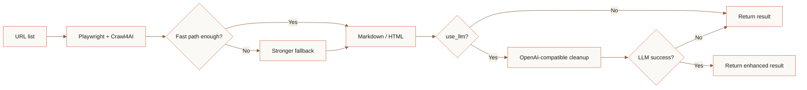
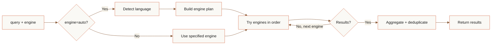

# crawl4ai-mcp

<div align="center">

[](https://www.gnu.org/licenses/agpl-3.0)
[](https://www.python.org/downloads/)
[](https://modelcontextprotocol.io)
[](https://playwright.dev)
[](https://github.com/unclecode/crawl4ai)
[](https://pypi.org/project/crawl4agent/)
[](https://github.com/pazyork/crawl4ai-mcp)

**A minimal MCP server for agent-friendly web extraction and search.**

Two tools: fetch real pages with Playwright + Crawl4AI, or search across 7 engines with automatic fallback.

</div>

---

## Quick entry

| Audience | Read this |
|---|---|
| Human developer | **[README.zh-CN.md](./README.zh-CN.md)** / **[README.md](./README.md)** |
| Living in the AI era, delegating your remaining sanity to an agent | **[README_AGENT.md](./README_AGENT.md)** |

## At a glance

| Item | Reality in this repo |
|---|---|
| MCP tools | **2 tools**: `fetch_urls` + `search_web` |
| Single-page fetch | `urls: ["https://example.com"]` |
| Web search | `search_web(query="...", engine="auto")` — 7 engines, auto fallback |
| Search engines | DuckDuckGo · Bing · Google · Yandex · Sogou · 360Search · Baidu |
| Output | `title + content + links + blocked + llm_used/llm_error` |
| Non-LLM mode | First-class, default, usable without any model |
| LLM mode | **Off by default**. Enabled only with `use_llm=true` + optional `llm_instruction` |
| Fallback | Missing/failed LLM call automatically falls back to non-LLM result |
| Anti-bot realism | proxy / cookies / persistent profile / randomized browser behavior |
| License | **AGPL-3.0-or-later** |

---

## How it works

**Fetch flow:**



**Search flow:**



---

## Installation

### Quick install (recommended)

**Step 1: Create a virtual environment**

```bash
# macOS/Linux - using system Python 3 (3.10-3.13)
python3 -m venv crawl4ai
source crawl4ai/bin/activate

# Windows
python -m venv crawl4ai
crawl4ai\Scripts\activate
```

**Step 2: Install**

```bash
pip install --upgrade pip
pip install crawl4agent
playwright install chromium
```

### Alternative methods

**If `python3` is too old (3.9 or below):**
```bash
# Use specific Python version (3.10, 3.11, 3.12, or 3.13)
python3.12 -m venv crawl4ai
source crawl4ai/bin/activate
pip install crawl4agent
```

**Using conda:**
```bash
conda create -n crawl4ai python=3.12
conda activate crawl4ai
pip install crawl4agent
playwright install chromium
```

**Using pipx (global command):**
```bash
pipx install crawl4agent
crawl4ai-mcp --help
```

### Troubleshooting

**Problem: "pip install" uses Python 2.7**
```bash
# macOS: use python3 explicitly
python3 -m pip install crawl4agent

# Or check which pip you're using
which pip
pip --version
```

**Problem: "No matching distribution found for crawl4agent"**
- Check Python version: `python3 --version` (must be 3.10-3.13)
- Upgrade pip: `python3 -m pip install --upgrade pip`

**Problem: "playwright install" fails**
- Use mirror (China): `export PLAYWRIGHT_DOWNLOAD_HOST=https://npmmirror.com/mirrors/playwright/`
- Then: `python3 -m playwright install chromium`

---

## Why this project exists

Most generic “web fetch” tools either fail on JS-heavy pages or return too much boilerplate. This project focuses on four things:

- **Non-LLM quality first**: usable even with zero model config
- **Minimal MCP surface**: easier for agents, easier to maintain
- **Pragmatic anti-bot workflow**: proxy / cookies / persistent profile are first-class
- **Golden regression review**: full markdown outputs can be saved and inspected page by page

---

## Core capabilities

### Non-LLM mode

| Capability | Actual behavior |
|---|---|
| Rendering | Real browser rendering via Playwright |
| Extraction | Crawl4AI markdown/html extraction |
| Fallback | Fast path → stronger path when content is too thin |
| Cleanup | Remove obvious noise, compress blanks, strip data-image placeholders |
| Site tuning | Medium / Claude Docs / GitHub and other mainstream sites |
| ChatGPT shared links | Full conversation extraction from `chatgpt.com/share/...` URLs |
| Video transcripts | YouTube / Bilibili URLs prefer subtitle extraction via `yt-dlp`, then fall back to webpage extraction |
| Block detection | `blocked=true` for likely verification/interstitial output |
| Batch control | Bounded concurrency via `concurrency` |

### Optional LLM mode

| Input | Meaning |
|---|---|
| `use_llm=true` | Turn on post-cleanup with an OpenAI-compatible model |
| `llm_instruction` | Tell the model what to keep / remove |

**Important reality check:**

- With `llm_instruction`, the prompt is **constraint-heavy** and biased toward preserving original lines.
- Without `llm_instruction`, the model does a more generic “clean readable markdown” pass.
- If the LLM call fails for any reason, the tool returns the original non-LLM extraction plus `llm_used=false` and `llm_error`.

---

## MCP Tools

### `fetch_urls`

```json
{
  "urls": ["https://a.com", "https://b.com"],
  "format": "markdown",
  "max_chars": 200000,
  "concurrency": 3,
  "use_llm": false,
  "llm_instruction": "keep only the tutorial body and in-body references"
}
```

Use a single-element list if you only need one page.

For supported video URLs (`youtube.com`, `youtu.be`, `bilibili.com`, `b23.tv`), `fetch_urls` prefers transcript extraction and returns readable markdown built from subtitles when available.

### Return shape

| Field | Meaning |
|---|---|
| `url` | Original URL |
| `final_url` | Final resolved URL after redirects |
| `title` | Extracted title |
| `content` | Markdown or HTML |
| `content_format` | `markdown` or `html` |
| `links` | Normalized extracted links |
| `video_metadata` | Present for supported video transcript extraction results |
| `blocked` | Likely anti-bot / verification / denied result |
| `llm_used` | Whether LLM enhancement was actually applied |
| `llm_error` | Why the LLM step degraded |

### `search_web`

```json
{
  "query": "crawl4ai web scraping",
  "engine": "auto",
  "max_results": 10,
  "lang": ""
}
```

| Parameter | Default | Description |
|---|---|---|
| `query` | (required) | Search query string |
| `engine` | `auto` | Engine to use: `auto`, `google`, `bing`, `duckduckgo`, `baidu` |
| `max_results` | `10` | Maximum number of results |
| `lang` | `""` | Language hint (e.g. `en`, `zh-CN`) |

When `engine="auto"`, the server tries engines in fallback order: DuckDuckGo → Bing → Google → Baidu. The first engine that returns results wins.

#### Search return shape

| Field | Meaning |
|---|---|
| `engine` | Which engine actually returned results |
| `query` | Original query |
| `results` | List of `{title, url, snippet}` |
| `total` | Number of results |
| `fallback_engines_tried` | Engines that failed before the successful one |

---

## Anti-bot realism

The server already includes randomized browser behavior in code:

| Mechanism | Actual status |
|---|---|
| Random viewport | Yes |
| Random user agent mode | Yes, when explicit UA is not provided |
| Delay jitter | Yes |
| `override_navigator` | Yes |
| `simulate_user` | Yes, in stronger fallback mode |
| Proxy / cookies / persistent profile | Supported via env vars |
| Cloudflare bypass | Enhanced browser fingerprinting + configurable wait strategies |

**Note**: For overseas websites (Medium, ProductHunt, etc.), using a proxy is recommended. The server supports HTTP/HTTPS/SOCKS5 proxies via `CRAWL4AI_MCP_PROXY` environment variable.

### Proxy input formats

`CRAWL4AI_MCP_PROXY` accepts all of these:

| Input | Interpreted as |
|---|---|
| `http://127.0.0.1:7890` | HTTP proxy |
| `https://127.0.0.1:7890` | HTTPS proxy |
| `socks5://127.0.0.1:7890` | SOCKS5 proxy |
| `socket5://127.0.0.1:7890` | Auto-normalized to `socks5://...` |
| `127.0.0.1:7890` | Auto-normalized to `http://127.0.0.1:7890` |
| `7890` | Auto-normalized to `http://127.0.0.1:7890` |

That means the README should not claim “perfect stealth”, but it can honestly claim **human-like randomization** and **practical anti-bot knobs**.

---

## Quickstart

### Conda

```bash
conda env create -f environment.yml
conda activate crawl4ai-mcp
python -m playwright install
crawl4ai-mcp
```

### venv

```bash
python -m venv .venv
source .venv/bin/activate
python -m pip install -U pip
python -m pip install -e '.[dev]'
python -m playwright install
crawl4ai-mcp
```

---

## MCP server config example

```json
{
  "mcpServers": {
    "crawl4ai": {
      "command": "crawl4ai-mcp",
      "env": {
        "CRAWL4AI_MCP_HEADLESS": "true",
        "CRAWL4AI_MCP_PROXY": "127.0.0.1:7890",
        "CRAWL4AI_MCP_NAVIGATION_TIMEOUT_MS": "30000",
        "CRAWL4AI_MCP_WAIT_UNTIL": "load",

        "OPENAI_BASE_URL": "https://your-openai-compatible-host",
        "OPENAI_API_KEY": "your-api-key",
        "OPENAI_MODEL": "your-model-name"
      }
    }
  }
}
```

LLM-related env vars are **optional**. `use_llm` is still **off by default** at call time. If any LLM env is missing, invalid, or the model call fails, the server automatically falls back to non-LLM extraction.

---

## Runtime configuration

| Env var | Purpose |
|---|---|
| `CRAWL4AI_MCP_HEADLESS` | Run browser headless |
| `CRAWL4AI_MCP_PROXY` | Upstream proxy, supports `http://`, `https://`, `socks5://`, `host:port`, and `port-only` |
| `CRAWL4AI_MCP_COOKIES_JSON` | Playwright storage state JSON |
| `CRAWL4AI_MCP_YTDLP_COOKIES_FROM_BROWSER` | Browser cookies source for video transcript extraction, e.g. `chrome`, `firefox:default` |
| `CRAWL4AI_MCP_YTDLP_COOKIEFILE` | Netscape cookies.txt path for `yt-dlp` video transcript extraction |
| `CRAWL4AI_MCP_USE_PERSISTENT_CONTEXT` | Reuse browser profile |
| `CRAWL4AI_MCP_USER_DATA_DIR` | Profile directory |
| `CRAWL4AI_MCP_NAVIGATION_TIMEOUT_MS` | Default max single navigation wait, default `30000` |
| `CRAWL4AI_MCP_WAIT_UNTIL` | Default page readiness strategy, default `load` |
| `OPENAI_BASE_URL` | OpenAI-compatible base URL |
| `OPENAI_API_KEY` | API key |
| `OPENAI_MODEL` | Model name |

---

## One-shot CLI

This project now exposes a stateless one-shot CLI in addition to the MCP stdio server.

Fetch a single URL once and print JSON:

```bash
crawl4agent fetch "https://obsidian.md/help/cli" --format markdown
```

Search the web once and print JSON:

```bash
crawl4agent search "agent framework" --engine auto --max-results 5
```

Use proxy and browser cookies for video transcript extraction:

```bash
crawl4agent fetch "https://www.youtube.com/watch?v=OFfwN23hR8U" \
  --proxy http://127.0.0.1:7890 \
  --cookies-from-browser chrome
```

Run golden smoke once and print a JSON array:

```bash
crawl4agent smoke --out-dir ./_golden_outputs
```

The existing `crawl4ai-mcp` command remains the MCP stdio server entrypoint for MCP hosts.

Available help surfaces:

```bash
crawl4agent --help
crawl4agent fetch --help
crawl4agent search --help
crawl4agent smoke --help
```

---

## Golden smoke regression

```bash
CRAWL4AI_MCP_SMOKE_DIR=./_golden_outputs .venv/bin/python -m crawl4ai_mcp.smoke_golden
```

For overseas video URLs, a local proxy is often needed:

```bash
CRAWL4AI_MCP_PROXY=http://127.0.0.1:7890 \
CRAWL4AI_MCP_SMOKE_DIR=./_golden_outputs \
.venv/bin/python -m crawl4ai_mcp.smoke_golden
```

This writes full markdown outputs to `_golden_outputs/` so you can inspect extraction quality page by page.

The golden set now includes the earlier baseline URLs plus `ainew.me`, `openclaw`, `watcha`, `producthunt`, `mydrivers`, `caihongtu`, `openrouter`, mobile Douban, and video pages from YouTube / Bilibili. For sites outside mainland China, proxy-based verification is recommended.

Some overseas sites may still return Cloudflare or similar verification pages even when a proxy is configured. In those cases the server now marks them with `blocked=true`. The recommended path is: better proxy quality, valid cookies, or a persistent browser profile after manual verification.

For some video golden URLs, subtitle extraction may require login. If `yt-dlp` reports login-required subtitles, configure either `CRAWL4AI_MCP_YTDLP_COOKIES_FROM_BROWSER` or `CRAWL4AI_MCP_YTDLP_COOKIEFILE` before running golden smoke.

---

## Prior art

- Crawl4AI: <https://github.com/unclecode/crawl4ai>
- mcp-crawl4ai-rag: <https://github.com/coleam00/mcp-crawl4ai-rag>
- weidwonder/crawl4ai-mcp-server: <https://github.com/weidwonder/crawl4ai-mcp-server>
- WaterCrawl: <https://github.com/watercrawl/WaterCrawl>
- teracrawl: <https://github.com/BrowserCash/teracrawl>

---

## License

This project is licensed under **AGPL-3.0-or-later**.
