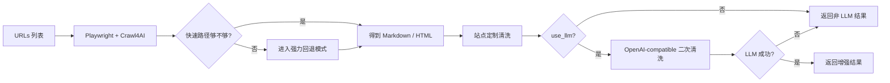

# crawl4ai-mcp

<div align="center">

[](https://www.gnu.org/licenses/agpl-3.0)
[](https://www.python.org/downloads/)
[](https://modelcontextprotocol.io)
[](https://playwright.dev)
[](https://github.com/unclecode/crawl4ai)
[](https://github.com/pazyork/crawl4ai-mcp)

**一个面向 Agent 的极简网页抓取 MCP 服务。**

基于 **Playwright + Crawl4AI**，输出 **正文优先 Markdown**，只保留 **一个 MCP 工具**，并支持可选的 **OpenAI-compatible LLM 清洗增强**。

</div>

---

## 快速入口

| 你是谁 | 看哪个文档 |
|---|---|
| 人类开发者 | **[README.zh-CN.md](./README.zh-CN.md)** / **[README.md](./README.md)** |
| Agent / Claude Code / Cursor / Windsurf | **[README_AGENT.md](./README_AGENT.md)** |

## 一眼看懂

| 项目项 | 当前仓库里的真实情况 |
|---|---|
| MCP 工具 | **只有 1 个**：`fetch_urls` |
| 抓单页 | 统一传 `urls: ["https://example.com"]` |
| 输出 | `title + content + links + blocked + llm_used/llm_error` |
| 非 LLM 模式 | 默认可用，不依赖模型 |
| LLM 模式 | `use_llm=true` 后做二次清洗，可带 `llm_instruction` |
| 降级策略 | LLM 失败自动回落到非 LLM 结果 |
| 反爬能力 | 代理 / cookies / persistent profile / 随机化浏览器行为 |
| 协议 | **AGPL-3.0-or-later** |

---

## 工作流



---

## 为什么做这个

很多网页抓取工具的问题是：**JS-heavy 页面抓不稳，或者抓出来全是导航、登录、广告、推荐流**。这个项目更关注四件事：

- **非 LLM 模式也要能用**：不配模型也能直接消费
- **MCP 工具面足够小**：越少越稳，越少越容易让 Agent 用对
- **反爬现实主义**：代理、cookies、持久 profile 都是第一层配置，不是事后补丁
- **golden 回归可审查**：完整 markdown 可以落盘逐页比对

---

## 核心能力

### 非 LLM 模式

| 能力 | 当前实际行为 |
|---|---|
| 页面渲染 | Playwright 真浏览器渲染 |
| 抽取引擎 | Crawl4AI markdown/html 提取 |
| 回退策略 | 快速路径 → 内容过薄时走强力路径 |
| 文本清洗 | 压缩空行、去明显噪音、去 data:image 占位图 |
| 站点规则 | Zhihu / 微信公众号 / Medium / CSDN / Claude Docs |
| blocked 标记 | 命中验证页 / interstitial / denied 特征时置 `blocked=true` |
| 并发抓取 | `concurrency` 控制并发上限 |

### 可选 LLM 模式

| 参数 | 含义 |
|---|---|
| `use_llm=true` | 开启 OpenAI-compatible 二次清洗 |
| `llm_instruction` | 告诉模型重点保留/删除什么 |

### 和代码一致的关键说明

- **传了 `llm_instruction`**：提示词会更偏“约束型过滤”，强调保留原文行序。
- **没传 `llm_instruction`**：走更通用的“清理可读 Markdown”模式。
- **LLM 调用失败**：不会让抓取失败，而是返回原始非 LLM 结果，并附带 `llm_used=false` 与 `llm_error`。

---

## 唯一 MCP 工具

### `fetch_urls`

```json
{
  "urls": ["https://a.com", "https://b.com"],
  "format": "markdown",
  "max_chars": 200000,
  "concurrency": 3,
  "use_llm": false,
  "llm_instruction": "只保留教程正文与文内引用"
}
```

如果只抓一个 URL，也统一传一个元素的数组。

### 输出字段

| 字段 | 含义 |
|---|---|
| `url` | 原始请求 URL |
| `final_url` | 跳转后的最终 URL |
| `title` | 抽取到的标题 |
| `content` | Markdown 或 HTML |
| `content_format` | `markdown` 或 `html` |
| `links` | 归一化后的链接列表 |
| `blocked` | 是否疑似命中反爬/验证页 |
| `llm_used` | 是否真的执行了 LLM 增强 |
| `llm_error` | LLM 降级原因 |

---

## 反爬与“像真人”行为

当前代码里已经有这些行为：

| 机制 | 当前状态 |
|---|---|
| 随机 viewport | 已启用 |
| 随机 UA 模式 | 已启用（未显式指定 UA 时） |
| 延迟抖动 | 已启用 |
| `override_navigator` | 已启用 |
| `simulate_user` | 强力回退模式启用 |
| proxy / cookies / persistent profile | 已支持 |

所以 README 应该诚实表达为：**带随机化的人类化行为 + 实用反爬配置**，而不是夸成“绝对隐身”。

---

## 快速开始

### Conda

```bash
conda env create -f environment.yml
conda activate crawl4ai-mcp
python -m playwright install
crawl4ai-mcp
```

### venv

```bash
python -m venv .venv
source .venv/bin/activate
python -m pip install -U pip
python -m pip install -e '.[dev]'
python -m playwright install
crawl4ai-mcp
```

---

## MCP 平台配置示例

```json
{
  "mcpServers": {
    "crawl4ai": {
      "command": "crawl4ai-mcp",
      "env": {
        "CRAWL4AI_MCP_HEADLESS": "true",

        "OPENAI_BASE_URL": "https://your-openai-compatible-host",
        "OPENAI_API_KEY": "your-api-key",
        "OPENAI_MODEL": "your-model-name"
      }
    }
  }
}
```

其中大模型相关参数是 **可选项**。只要缺任意一项、配置非法，或者模型调用失败，服务都会自动回退到非 LLM 抓取结果。

---

## 运行时配置

| 环境变量 | 作用 |
|---|---|
| `CRAWL4AI_MCP_HEADLESS` | 是否无头运行 |
| `CRAWL4AI_MCP_PROXY` | 上游代理 |
| `CRAWL4AI_MCP_COOKIES_JSON` | Playwright storage_state JSON |
| `CRAWL4AI_MCP_USE_PERSISTENT_CONTEXT` | 是否复用浏览器 profile |
| `CRAWL4AI_MCP_USER_DATA_DIR` | 浏览器 profile 目录 |
| `OPENAI_BASE_URL` | OpenAI-compatible base URL |
| `OPENAI_API_KEY` | 模型服务密钥 |
| `OPENAI_MODEL` | 模型名 |

---

## Golden smoke 回归

```bash
CRAWL4AI_MCP_SMOKE_DIR=./_golden_outputs .venv/bin/python -m crawl4ai_mcp.smoke_golden
```

它会把完整 Markdown 落到 `_golden_outputs/`，方便你逐页人工审查提取效果。

---

## 参考项目

- Crawl4AI：<https://github.com/unclecode/crawl4ai>
- mcp-crawl4ai-rag：<https://github.com/coleam00/mcp-crawl4ai-rag>
- weidwonder/crawl4ai-mcp-server：<https://github.com/weidwonder/crawl4ai-mcp-server>
- WaterCrawl：<https://github.com/watercrawl/WaterCrawl>
- teracrawl：<https://github.com/BrowserCash/teracrawl>

---

## 协议

本项目使用 **AGPL-3.0-or-later**。
